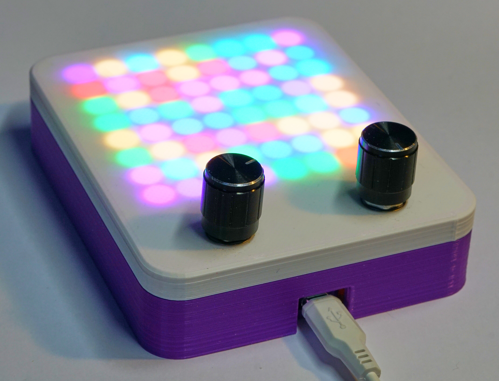
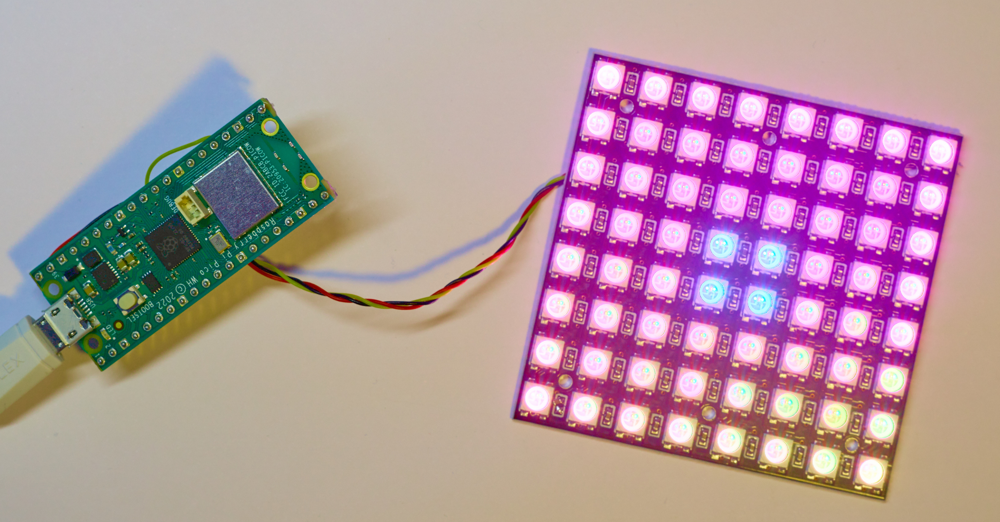
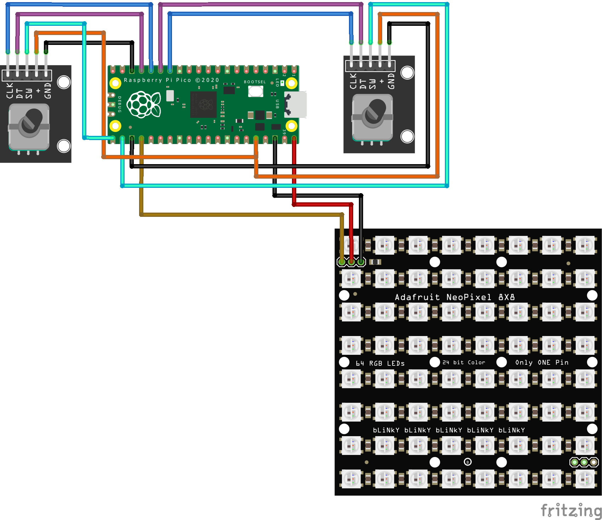

# Max_Python
Pick up extra Python Skills. All the examples have been written to run in MicroPython on a Raspberry Pi PICO device.

You can build a box like this, or you can just connect an 8x8 Neopixel display to a PICO

The display is connected to GND, VSYS and GP18. 

This is a full circuit diagram for the box. You can find 3D printable designs for the case in the case folder. 

# Samples

## Colour Class

* **01Colours** - displays pixels using the Col class

## Asyncio

* **02FlickeringPixel** - uses a non-returning loop to flicker a single pixel
* **03AsyncioFlicker** - uses the same code structure, but runs the flickering loop as an async coroutine
* **04MultipleFlicker** - flickers two leds simultaneously using two coroutines
* **05Flickering64Leds** - flickers 64 leds using the gather function to start 64 coroutines
* **06FlickeringLedsWithDraw** - removes the neopixel write action from individual pixels and adds a draw task to improve performance
* **07RotarySpeedControl** - adds a coroutine which reads a rotary encoder and controls the speed at which the flickering display updates

## PICO Second core

Double the processing power available to your application by running code on core 1.

* **08DualPrint** - runs both cores and shows that print is not core safe
* **09DualPrintSync** - adds a lock so that the two cores don't fight over the print function
* **10PerlinNoise** - uses core1 to create a fake [Perlin noise](https://en.wikipedia.org/wiki/Perlin_noise) raster and uses core2 to render this on an 8x8 neoppixel array 

## Classes

Create a simple sprite class hierarchy. 

* **11MakeSprite** - make a parent Sprite class and a Dot class
* **12DotandBlock** - add a Block class
* **13DotsAndBlocks** - lots of dots and blocks in a playfield list

# Browser to Python

The BrowserToPython folder contains web pages and Python files which implement the transfer of colour information from a PC to a PICO running MicroPython:

* **Transmitter.html** - implements a web page containing a colour picker which connects over a serial connection to a PICO and sets the colour of the display.
* **PrettyTransmitter.html** - implements a prettier web page with a status display
* **Receiver.py** - runs in a PICO, receives colour values and displays them on NeoPixels
* **Save.py** - receives colour values and stores them in a local file so that a default light colour can be set.

Have Fun

Rob Miles 
